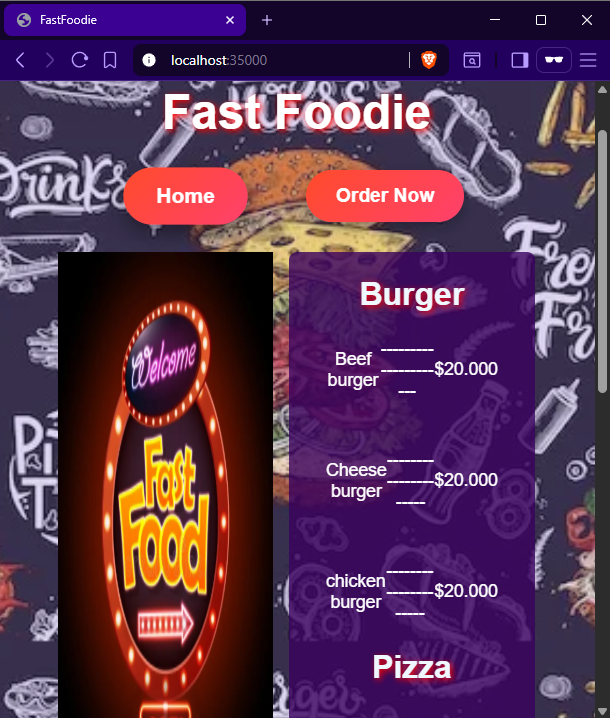
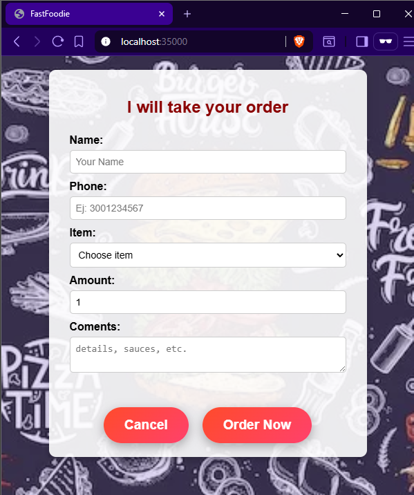

# Fast foodie - AREP_Lab01
Este proyecto implementa un servidor web HTTP básico en Java que sirve archivos estáticos (HTML, CSS, JS, imágenes) y maneja solicitudes REST para la aplicación FastFoodie. El servidor fue desarrollado sin utilizar frameworks como Spring o Spark, usando solo las librerías básicas de Java para networking (java.net) y manejo de archivos (java.io).

# Requisitos previos
###  Java JDK 8 o superior
se pueden tener varias versiones de java JDK instaladas, pero para este proyecto es importante contar con JDK 8.

Puedes obtenerlo en el siguiente enlace:
[java JDK version 8](https://www.oracle.com/latam/java/technologies/javase/javase8-archive-downloads.html)

1. descargar el archivo compatible con el respectivo sistema operativo.

2. ejecutar el instalador y seguir todas las instrucciones.
    >Nota: se recomienda dejar todos los valores por defecto
3. Una vez instalado, busca en tu equipo **"Variables de entorno"** y ábrelo.  
4. En **Variables del sistema**, localiza la variable `JAVA_HOME` y selecciónala para **editar**.  
   - Si no existe, crea una nueva variable llamada `JAVA_HOME`.  
5. En el campo de **Valor de la variable**, coloca la ruta de instalación del JDK (por lo general):
    ```
    C:\Program Files\Java\
    ```

6. Guarda los cambios haciendo clic en **Aceptar** en todas las ventanas.  

¡Listo! El JDK quedará configurado para usarlo.

---

### Apache Maven  
Para compilar y gestionar dependencias del proyecto, es necesario tener instalado **Apache Maven**.  

Puedes obtenerlo en el siguiente enlace:  
[Descargar Apache Maven](https://maven.apache.org/download.cgi)  

1. Descarga la versión **binaria ZIP** compatible con tu sistema operativo.  
2. Extrae el contenido del archivo ZIP en una ubicación de tu preferencia.  
   > Ejemplo: `C:\apache-maven`  
3. Busca en tu equipo **"Variables de entorno"** y ábrelo.  
4. En **Variables del sistema**, localiza la variable `path` y selecciónala para **editar**.    
5. selecciona **nuevo**, coloca la ruta donde descomprimiste Maven seleccionando la carpeta bin:  
   > Ejemplo: `C:\apache-maven\bin` 
6. Guarda los cambios haciendo clic en **Aceptar** en todas las ventanas.  

#### Verificación de instalación  
Para confirmar que Maven está instalado correctamente, abre una terminal y ejecuta:  
```
mvn -version
```
Si todo está bien configurado, verás la versión de Maven, Java y el sistema operativo.

***
### Git (opcional)
Git es un sistema de control de versiones distribuido, necesario para manejar el código del proyecto.  
Podemos descargarlo desde el siguiente enlace oficial:  

[Descargar Git](https://git-scm.com/downloads)

#### Instalación:
1. Selecciona tu sistema operativo (Windows, macOS o Linux) y descarga el instalador correspondiente.
2. Ejecuta el instalador y sigue las instrucciones.
   - Se recomienda dejar las opciones por defecto, a menos que tengas una configuración específica.
3. Una vez instalado, abre una terminal o consola de comandos y verifica que Git está correctamente instalado ejecutando:
    ```
    git --version
    ```

# Primeros pasos

1. **Obtener el proyecto**  
   Puedes obtener el proyecto de dos maneras:

   - **Descargando el .zip**  
     [Click aquí](https://github.com/XxELIngexX/AREP-T1.git), luego haz clic en el botón **"<> Código"** y selecciona **"Download ZIP"**.  
     Descomprime el archivo, abre una terminal y ubícate en el directorio del proyecto.

   - **Clonando el repositorio**  
     Abre una terminal y ejecuta:
     ```bash
     git clone https://github.com/XxELIngexX/AREP-T1.git
     ```
     ```
     cd AREP-T1
     ```
2. **Compilar el proyecto**
   Una vez en el directorio del proyecto, compila y descarga las dependencias con:
    ```
    mvn clean install
    ```

Esto generará los archivos compilados en la carpeta target/.


3. **Ejecutar el servidor** 
una vez compilado, ejecutar:
    ```
    java -cp target/WebServer-1.0-SNAPSHOT.jar edu.escuelaing.Lab01.HttpServer
    ```

# Ejemplo de uso

Una vez que el servidor esté ejecutándose:

1. Abre tu navegador y visita:
Verás la página principal de **FastFoodie**.

2. Haz clic en "Ver Menú" para obtener la lista de productos.  
Esto realiza una solicitud `fetch` al servidor y carga el archivo `menu.html` y lo s recursos que este utiliza como  los archivos de estilos `.css` y los archivos javaScript `.js` desde el backend.

3. Haz clic en "Realizar Pedido" para abrir el formulario de orden.  
Completa tus datos, selecciona un producto y envía el pedido.  
El sistema mostrará un mensaje de confirmación.





